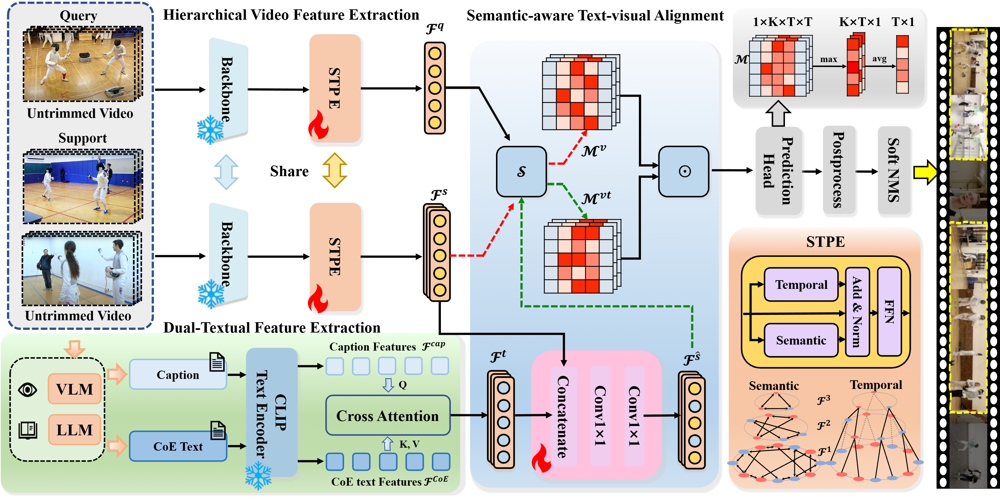
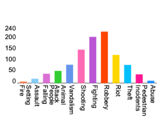
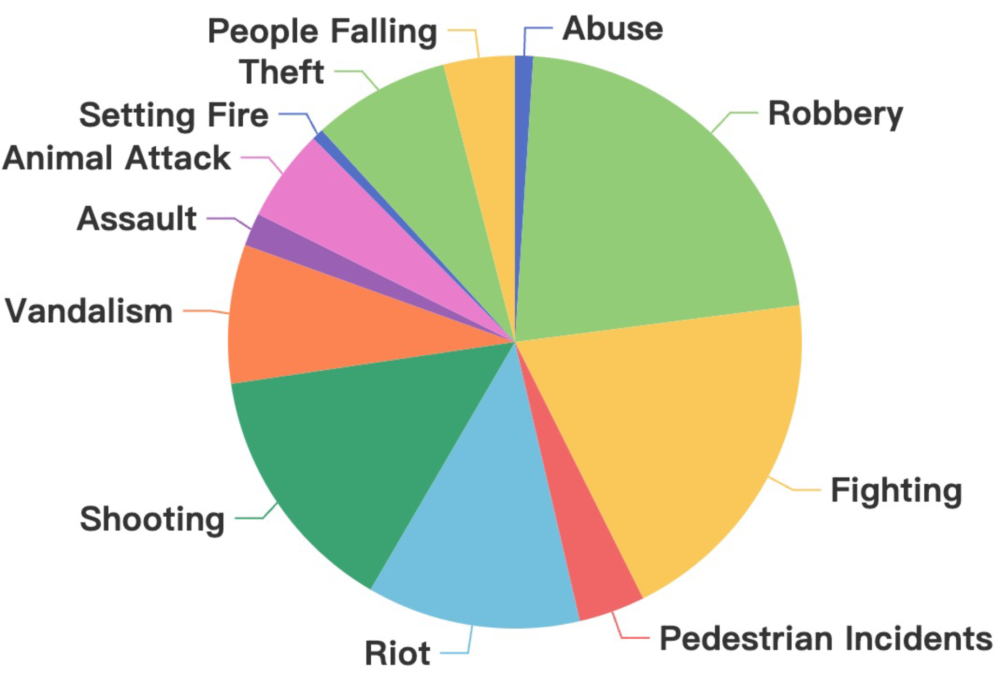
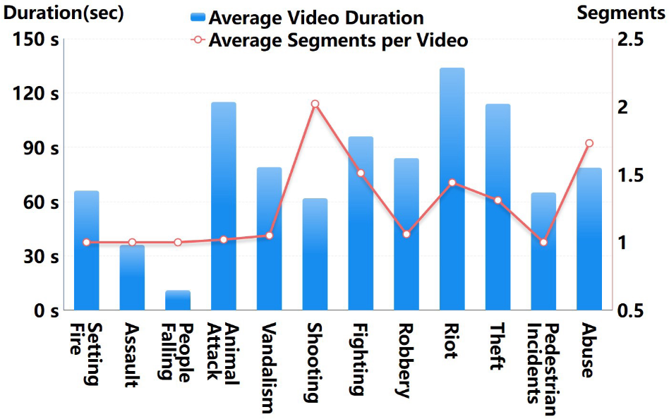
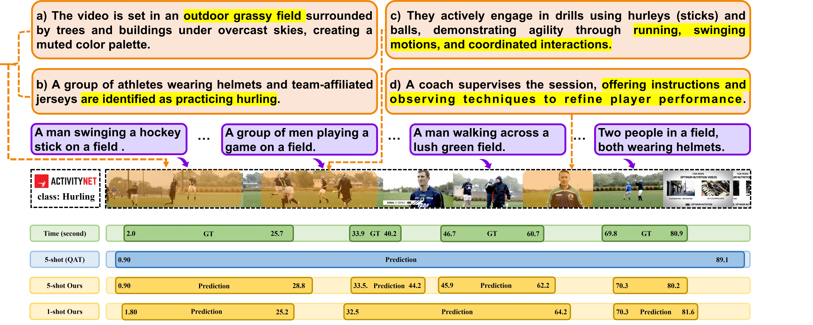
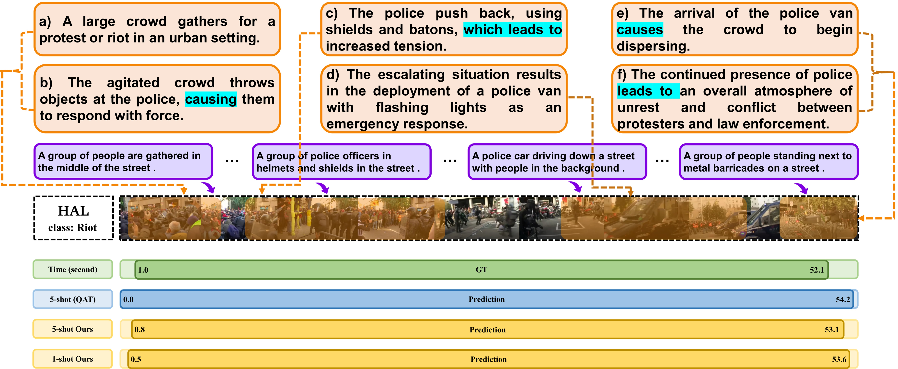

<div align="center" style="font-family: charter;">

<h1><i>Chain-of-Evidence Multimodal Reasoning</i></br> for Few-shot Temporal Action Localization</h1>

<br />

<a href="https://arxiv.org/abs/2504.13460" target="_blank">
    
</a>

<div>
    <a href="https://jueduilingdu.github.io/" target="_blank">Mengshi Qi</a><sup>1*</sup>,
    <a href="#" target="_blank">Hongwei Ji</a><sup>1</sup>,
    <a href="#" target="_blank">Wulian Yun</a><sup>1</sup>,
    <a href="#" target="_blank">Xianlin Zhang</a><sup>1</sup>,
    <a href="#" target="_blank">Huadong Ma</a><sup>1</sup>
</div>

<div>
    <sup>1</sup>Beijing University of Posts and Telecommunications&emsp;
</div>



<p align="justify"><i>Traditional few-shot temporal action localization (TAL) often overlooks textual semantics. We propose a Chain-of-Evidence (CoE) multimodal reasoning method that integrates semantic-aware text-visual alignment to capture action variations. By modeling temporal and causal dependencies, our CoE approach guides vision-language models to generate descriptive text that enhances localization performance beyond purely visual features.</i></p>

</div>

## Release
- (December, 2025) 📊 We released the visual and textual features.
- (October, 2025) 🚀 We released training and inference code.

## Abstract
Traditional temporal action localization (TAL) methods rely on large amounts of detailed annotated data, whereas few-shot TAL reduces this dependence by using only a few training samples to identify unseen action categories. However, existing few-shot TAL methods typically focus solely on visual information, neglecting textual information, which can provide valuable semantic support for the action localization task. To address these issues, in this work, we propose a new few-shot temporal action localization method by Chain-of-Evidence multimodal reasoning to improve localization performance. Specifically, we design a novel few-shot learning framework to capture action commonalities and variations, which includes a semantic-aware text-visual alignment module designed to align the query and support videos at different levels. Meanwhile, to better express the temporal dependencies and causal relationships between actions at the textual level, we design a Chain-of-Evidence (CoE) reasoning method that progressively guides the Vision Language Model (VLM) and Large Language Model (LLM) to generate CoE text descriptions for videos. The generated texts can capture more variance of action than visual features. We conduct extensive experiments on the publicly available ActivityNet1.3, THUMOS14 and our newly collected Human-related Anomaly Localization Dataset. The experimental results demonstrate that our proposed method significantly outperforms existing methods in single-instance and multi-instance scenarios. 

## Summary
- We introduce a new few-shot learning method for the TAL task, which leverages hierarchical video features
with textual semantic information to enhance the alignment of query and support.
- We design a novel Chain-of-Evidence reasoning method to generate textual descriptions to effectively and explicitly describe temporal dependencies and causal relationships between actions.
- We collect and annotate the first benchmark for human-related anomaly localization, which includes 12 types of
anomalies, 1,159 videos and more than 2,543,000 frames
in total.


## Human-related Anomaly Localization Dataset
To extend the application of temporal action localization to the more practical domains such as human-related anomaly detection, we construct a new Human-related Anomaly Localization (HAL) benchmark. The core feature of HAL is the Chain-of-Evidence (CoE) textual descriptions that we newly generated. Compared to the textual information used in prior works like [TAL](https://github.com/benedettaliberatori/T3AL), this new format is richer in logic and more clearly structured. To efficiently generate the CoE texts, we design an automated CoE reasoning pipeline that guides the VLM and LLM to perform reasoning about the evidence of the causal inference in the video content. The goal is to leverage this causality-infused text to indirectly imbue the localization task with the reasoning capabilities of LLMs, which allows the model to achieve a more precise understanding and localization of complex anomalous events.


<div align="center">
  
  
  
</div>

## Qualitative Performance
We utilize the mean average precision (mAP) as an evaluation metric to assess the performance of our method, consistent with prior state-of-the-art work, and report mAP at an IoU threshold of 0.5.




## Installation
1. Dependencies
* Python == 3.9
* torch== 2.4.1

2. Create conda environment
    ```shell script
    conda env create -f environment.yml
    source activate valvlm
    ```

## Training and Evaluation
> To Train on support split and Test on query split run this

```
python train.py --shot 5 --batch_size 100 --train_episodes 100 --epoch 200
python test.py --shot 5  --test_episodes 100
python train.py --shot 1 --batch_size 100 --train_episodes 100 --epoch 200
python test.py --shot 1  --test_episodes 100
```

## Few Shot Split Setting 

1. The Class Split is given as follows :
* Base CLass --> 160 Class
```bash
['Fun sliding down', ' Beer pong', ' Getting a piercing', ' Shoveling snow', ' Kneeling', ' Tumbling', ' Playing water polo', ' Washing dishes', ' Blowing leaves', ' Playing congas', ' Making a lemonade', ' Playing kickball', ' Removing ice from car', ' Playing racquetball', ' Swimming', ' Playing bagpipes', ' Painting', ' Assembling bicycle', ' Playing violin', ' Surfing', ' Making a sandwich', ' Welding', ' Hopscotch', ' Gargling mouthwash', ' Baking cookies', ' Braiding hair', ' Capoeira', ' Slacklining', ' Plastering', ' Changing car wheel', ' Chopping wood', ' Removing curlers', ' Horseback riding', ' Smoking hookah', ' Doing a powerbomb', ' Playing ten pins', ' Getting a haircut', ' Playing beach volleyball', ' Making a cake', ' Clean and jerk', ' Trimming branches or hedges', ' Drum corps', ' Windsurfing', ' Kite flying', ' Using parallel bars', ' Doing kickboxing', ' Cleaning shoes', ' Playing field hockey', ' Playing squash', ' Rollerblading', ' Playing drums', ' Playing rubik cube', ' Sharpening knives', ' Zumba', ' Raking leaves', ' Bathing dog', ' Tug of war', ' Ping-pong', ' Using the balance beam', ' Playing lacrosse', ' Scuba diving', ' Preparing pasta', ' Brushing teeth', ' Playing badminton', ' Mixing drinks', ' Discus throw', ' Playing ice hockey', ' Doing crunches', ' Wrapping presents', ' Hand washing clothes', ' Rock climbing', ' Cutting the grass', ' Wakeboarding', ' Futsal', ' Playing piano', ' Baton twirling', ' Mooping floor', ' Triple jump', ' Longboarding', ' Polishing shoes', ' Doing motocross', ' Arm wrestling', ' Doing fencing', ' Hammer throw', ' Shot put', ' Playing pool', ' Blow-drying hair', ' Cricket', ' Spinning', ' Running a marathon', ' Table soccer', ' Playing flauta', ' Ice fishing', ' Tai chi', ' Archery', ' Shaving', ' Using the monkey bar', ' Layup drill in basketball', ' Spread mulch', ' Skateboarding', ' Canoeing', ' Mowing the lawn', ' Beach soccer', ' Hanging wallpaper', ' Tango', ' Disc dog', ' Powerbocking', ' Getting a tattoo', ' Doing nails', ' Snowboarding', ' Putting on shoes', ' Clipping cat claws', ' Snow tubing', ' River tubing', ' Putting on makeup', ' Decorating the Christmas tree', ' Fixing bicycle', ' Hitting a pinata', ' High jump', ' Doing karate', ' Kayaking', ' Grooming dog', ' Bungee jumping', ' Washing hands', ' Painting fence', ' Doing step aerobics', ' Installing carpet', ' Playing saxophone', ' Long jump', ' Javelin throw', ' Playing accordion', ' Smoking a cigarette', ' Belly dance', ' Playing polo', ' Throwing darts', ' Roof shingle removal', ' Tennis serve with ball bouncing', ' Skiing', ' Peeling potatoes', ' Elliptical trainer', ' Building sandcastles', ' Drinking beer', ' Rock-paper-scissors', ' Using the pommel horse', ' Croquet', ' Laying tile', ' Cleaning windows', ' Fixing the roof', ' Springboard diving', ' Waterskiing', ' Using uneven bars', ' Having an ice cream', ' Sailing', ' Washing face', ' Knitting', ' Bullfighting', ' Applying sunscreen', ' Painting furniture', ' Grooming horse', ' Carving jack-o-lanterns']
```
* Validation Class ( To evaluate Base Class ) --> 20 Class
```bash
['Swinging at the playground', ' Dodgeball', ' Ballet', ' Playing harmonica', ' Paintball', ' Cumbia', ' Rafting', ' Hula hoop', ' Cheerleading', ' Vacuuming floor', ' Playing blackjack', ' Waxing skis', ' Curling', ' Using the rowing machine', ' Ironing clothes', ' Playing guitarra', ' Sumo', ' Putting in contact lenses', ' Brushing hair', ' Volleyball']
```
* Testing Class ( Support / Query ) --> 20 Class
```bash
['Hurling', ' Polishing forniture', ' BMX', ' Riding bumper cars', ' Starting a campfire', ' Walking the dog', ' Preparing salad', ' Plataform diving', ' Breakdancing', ' Camel ride', ' Hand car wash', ' Making an omelette', ' Shuffleboard', ' Calf roping', ' Shaving legs', ' Snatch', ' Cleaning sink', ' Rope skipping', ' Drinking coffee', ' Pole vault']
```

## Acknowledgment
Our evaluation code is built upon [FS-QAT](https://github.com/sauradip/fewshotQAT) and adopts the captions of ActivityNet1.3 and THUMOS14 datasets from [T3AL](https://github.com/benedettaliberatori/T3AL). We thank the authors for making the code available.

## Citation
If you find this project useful for your research, please use the following BibTeX entry.
```
@misc{qi2025chainofevidencemultimodalreasoningfewshot,
      title={Chain-of-Evidence Multimodal Reasoning for Few-shot Temporal Action Localization}, 
      author={Mengshi Qi and Hongwei Ji and Wulian Yun and Xianlin Zhang and Huadong Ma},
      year={2025},
      eprint={2504.13460},
      archivePrefix={arXiv},
      primaryClass={cs.CV},
      url={https://arxiv.org/abs/2504.13460}, 
}
```

